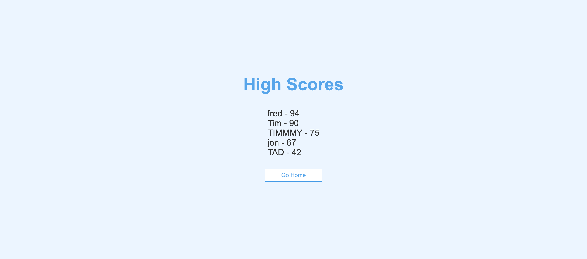

# JavaScript Code Quiz

## User Story

```
AS A coding boot camp student
I WANT to take a timed quiz on JavaScript fundamentals that stores high scores
SO THAT I can gauge my progress compared to my peers
```

## Description

- This is a quiz to test your knowledge of JavaScript.
- Click the PLAY button
- When you start the game questions will appear and you will have multiple choices to answer.
- If you answer correctly, you will see a green background and the next question will appear.
- If you answer incorrectly, you will see a red background and 5 seconds will be deducted from the timer.

## Mock-up

- Home Screen
  

- Questions Screen
  

- Intials Screen
  

- High Scores Screen
  
